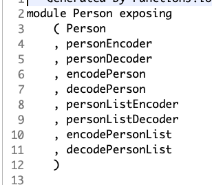
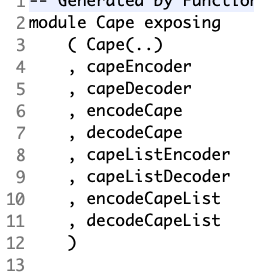

# JavaElmExample

This project demonstrates how to use Java + Elm with the help of FunctionalJ.io.

## Step 1 - Add dependency.

Add `pom.xml` dependency to `functionalj-all` version `0.5.8.0` or newer.

    <dependency>
        <groupId>io.functionalj</groupId>
        <artifactId>functionalj-all</artifactId>
        <version>0.5.8.0</version>
    </dependency>

See [on GitHub](https://github.com/NawaMan/JavaElmExample/blob/main/pom.xml#L112-L116)

## Step 2 - Java code.

Add Java classes specifying the data model - either [Struct](https://dzone.com/articles/immutable-data-with-functionalio) or [Choice](https://dzone.com/articles/choice-types-in-java-with-functionaljio) type.
Also add the `@Elm` annotation to specify that Elm code should be generated.

`baseModule` specifies module in the generated Elm code -- default to `FROM_PACAKGE_NAME`.

`generatedDirectory` specifies the directory for the generated code -- default to `./generated/elm/`.

    @Struct
    @Elm(baseModule = "", generatedDirectory = "elm/src/")
    static interface PersonModel extends RestData {
        @Nullable String id();
        @Required String firstName();
        @Required String lastName();
        @Nullable String nickName();
        @Required Cape   cape();
    }
    
    @Choice
    @Elm(baseModule = "", generatedDirectory = "elm/src/")
    static interface CapeModel {
        void Color(String color);
        void None();
    }

See [on GitHub](https://github.com/NawaMan/JavaElmExample/blob/main/src/main/java/javaelmexample/services/PersonService.java#L28-L43)

That is it!!!!

How the JavaElm should generates two Elm file: [Person.elm](https://github.com/NawaMan/JavaElmExample/blob/main/elm/src/Person.elm) and [Cape](https://github.com/NawaMan/JavaElmExample/blob/main/elm/src/Cape.elm).

These file contains the declaration of those data types as well as the encoder/decoder of the data types as well as the list of those types.

Enjoy Coding!
